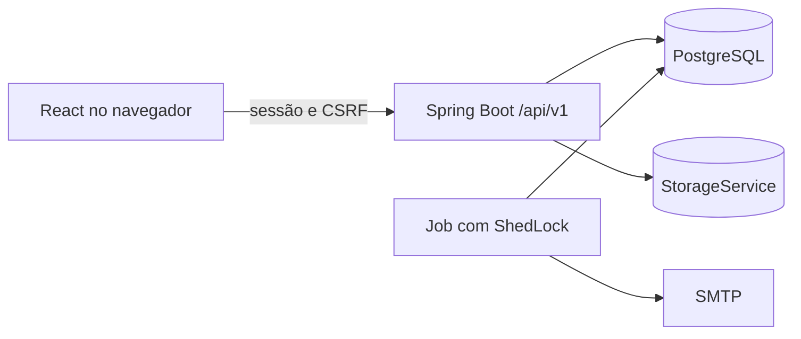

# Arquitetura e plano de entrega

## Módulos

O backend é um monólito modular com os módulos `usuarios`, `chamados`, `comentarios`, `anexos`, `historico`, `notificacoes`, `sla`, `dashboard`, `conhecimento`, `admin` e `compartilhado`. O frontend React usa rotas por perfil e consome somente `/api/v1`. PostgreSQL armazena dados e outbox; MinIO ou storage S3 compatível armazena anexos; SMTP entrega notificações.

## Ordem

| Etapa | Entrega | Risco a controlar |
| --- | --- | --- |
| E0 | Estrutura, builds, Compose, CI, ADRs e documentação | Reproduzir ambiente local |
| E1 | OIDC, provisionamento, perfis e sessão | Identidade inativa e CSRF |
| E2–E4 | Chamados, fila, status, histórico, comentários e anexos | IDOR, notas internas e concorrência |
| E5 | Outbox e envio | Falha e duplicação de e-mail |
| E6–E8 | SLA, dashboard, administração, reabertura e avaliação | Cálculo em horas úteis |
| E9–E11 | Conhecimento, gestão e hardening | Retenção, desempenho e operação |

## Suposições iniciais

- Uma única organização e um único provedor OIDC por ambiente.
- A aplicação será publicada sob HTTPS e mesma origem do frontend em produção.
- `America/Sao_Paulo` é o fuso de exibição; instantes persistidos serão UTC.
- O código de tarefas existente é legado distinto do helpdesk e será preservado em `legacy/task-manager-cli` sem ser incluído nos builds novos.
- Não há Docker instalado na máquina atual; a validação de Compose dependerá de um ambiente com Docker.

